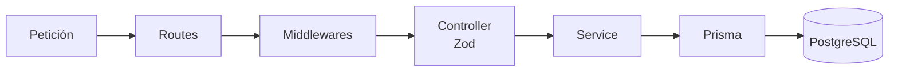
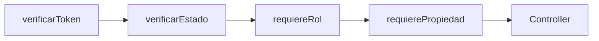

# UNIFIT — Backend

API REST del sistema UNIFIT. Aplicación Express en TypeScript con Prisma como ORM, organizada por capas.

## Stack

- **Node.js** 20+
- **Express** 5
- **TypeScript**
- **Prisma ORM** (PostgreSQL)
- **Zod** para validación de entrada
- **JWT** (`jsonwebtoken`) + **bcrypt** para autenticación
- **Groq SDK** para generación de rutinas con IA
- **Vitest + Supertest** para pruebas

## Estructura por capas

```
src/
├── app.ts                 # Punto de entrada / configuración de Express
├── routes/                # Definición de rutas y encadenamiento de middlewares
├── middlewares/           # Seguridad y control de acceso
│   ├── verificarToken.ts
│   ├── verificarEstado.ts
│   ├── requiereRol.ts
│   └── requierePropiedad.ts
├── controllers/           # Validación (Zod) y orquestación
├── services/              # Lógica de negocio
├── types/                 # Tipos compartidos
└── utils/                 # prisma, manejo de errores
```

### Flujo de una petición



## Variables de entorno

Copiar `.env.example` a `.env` y completar los valores:

| Variable | Descripción |
|---|---|
| `DATABASE_URL` | URL de conexión a PostgreSQL |
| `PORT` | Puerto del servidor (por defecto `3000`) |
| `JWT_SECRET` | Clave para firmar tokens JWT |
| `JWT_EXPIRES_IN` | Tiempo de expiración del token (ej. `8h`) |
| `CLOUDINARY_CLOUD_NAME` | Cloud name de Cloudinary (archivos) |
| `CLOUDINARY_API_KEY` | API key de Cloudinary |
| `CLOUDINARY_API_SECRET` | API secret de Cloudinary |
| `GROQ_API_KEY` | API key de Groq (IA) |
| `GROQ_MODELO` | Modelo de IA (por defecto `openai/gpt-oss-20b`) |
| `BIOMETRIA_API_KEY` | API key para autenticar al hardware (bridge ESP32) |

## Scripts

```bash
npm run dev              # Inicia en modo desarrollo (tsx watch)
npm run build            # Compila TypeScript a dist/
npm start                # Ejecuta la versión compilada
npm test                 # Ejecuta la suite de pruebas (Vitest)
npm run prisma:generate  # Genera el cliente de Prisma
npm run prisma:migrate   # Aplica migraciones de base de datos
npm run prisma:seed      # Carga datos de prueba (seed)
```

## Configuración de la base de datos

1. Configura `DATABASE_URL` en `.env`.
2. Genera el cliente de Prisma:

   ```bash
   npm run prisma:generate
   ```

3. Aplica las migraciones:

   ```bash
   npm run prisma:migrate
   ```

4. (Opcional) Carga datos de prueba:

   ```bash
   npm run prisma:seed
   ```

## Pruebas

Suite de pruebas con **Vitest + Supertest**. Cubre los siguientes casos por endpoint:

- Camino exitoso (happy path).
- Validación fallida (`400`).
- Permiso denegado por rol (`403`).
- Escalada horizontal bloqueada (`403`) — acceso a recurso de otro usuario.
- Recurso no encontrado (`404`).
- Sin token / token inválido (`401`).

```bash
npm test
```

## Seguridad

La autorización se implementa mediante una cadena de middlewares que se ejecuta en este orden:



- **`verificarToken`**: autenticación (JWT). Previene acceso sin identidad válida.
- **`verificarEstado`**: valida el estado del usuario (`pendiente`/`activo`/`inactivo`).
- **`requiereRol`**: previene **escalada vertical** (un rol accediendo a acciones de un rol mayor).
- **`requierePropiedad`**: previene **escalada horizontal** (acceder a datos de otro usuario cambiando un ID).

Dos mecanismos de autenticación distintos:

- **Usuarios** → JWT (header `Authorization: Bearer ...`).
- **Hardware (bridge/ESP32)** → API Key (header `x-api-key`), comparada con `BIOMETRIA_API_KEY`.

Las contraseñas se almacenan con **bcrypt** (hash, no cifrado reversible). La contraseña inicial es el número de documento y se exige su cambio en el primer inicio de sesión.