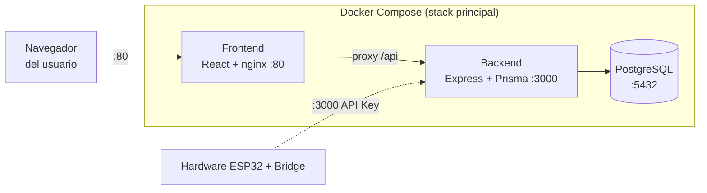
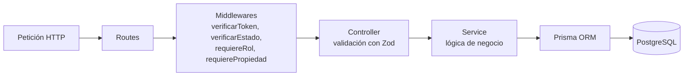
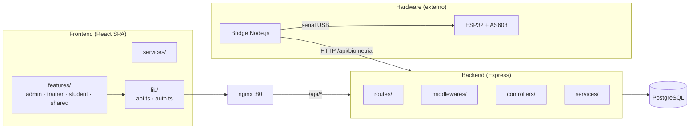

# UNIFIT

Sistema integral de gestión para el gimnasio universitario: registro de usuarios, valoración física, generación de rutinas con inteligencia artificial, control de acceso por huella digital y seguimiento de asistencia.

## ¿Qué problema resuelve?

UNIFIT centraliza en una sola plataforma los procesos que normalmente se manejan por separado en un gimnasio institucional:

- Registro y activación de usuarios (con documentos legales y PAR-Q).
- Valoración física y generación de rutinas personalizadas con IA.
- Control de acceso y asistencia mediante biometría (huella digital).
- Gestión administrativa de equipos, agenda y cupos.

## Arquitectura

El sistema es un **monolito modular por capas** desplegado con Docker Compose, más un **componente externo de hardware** que corre fuera del stack.

### Vista de despliegue



> El **hardware** (ESP32 + sensor AS608 + bridge) **no forma parte del stack Docker**.
> Es un cliente externo instalado físicamente en la recepción del gimnasio que se
> comunica con el backend por red. Ver [`hardware/README.md`](hardware/README.md).

### Vista de capas (backend)

Cada petición atraviesa la siguiente cadena:



### Vista de componentes



## Requisitos previos

- [Node.js](https://nodejs.org/) 20 o superior
- [Docker](https://www.docker.com/) y Docker Compose (para el despliegue completo)
- Para desarrollo local: npm

## Puesta en marcha

### Con Docker Compose (recomendado)

1. Crea tu archivo de entorno a partir de la plantilla:

   ```bash
   cp .env.docker .env
   ```

   Edita `.env` y completa las claves reales (JWT, Cloudinary, Groq, biometría).

2. Levanta el stack completo:

   ```bash
   docker compose up --build
   ```

   - Frontend: http://localhost:80
   - Backend: http://localhost:3000
   - PostgreSQL: `localhost:5432`

### En desarrollo (sin Docker)

Consulta las instrucciones específicas en:

- [`Backend/README.md`](Backend/README.md)
- [`Frontend/README.md`](Frontend/README.md)

## Estructura del repositorio

```
.
├── Backend/                # API Express + Prisma (TypeScript)
│   ├── prisma/             # schema, migraciones y seed
│   └── src/                # routes, middlewares, controllers, services, utils
├── Frontend/               # SPA React + Vite (TypeScript)
│   └── src/                # features, services, lib, modules, shared
├── hardware/               # Componente biométrico EXTERNO (fuera de Docker)
│   └── esp32-as608/        # firmware ESP32 + puente (bridge) Node.js
├── docs/                   # Documentación de reglas de negocio y protocolos
├── docker-compose.yml      # Stack principal (postgres + backend + frontend)
├── .env.docker             # Plantilla de variables de entorno para Docker
└── .env.example            # (ver Backend/ y Frontend/)
```

## Documentación

- [`docs/reglas-negocio.md`](docs/reglas-negocio.md) — reglas de negocio y matriz de permisos por rol.
- [`docs/protocolo-biometrico.md`](docs/protocolo-biometrico.md) — protocolo biométrico de enrolamiento y verificación.
- [`docs/flujo-trabajo-x-modulos.md`](docs/flujo-trabajo-x-modulos.md) — proceso estándar por módulo.
- [`docs/diagnostico-formulario-registro.md`](docs/diagnostico-formulario-registro.md) — análisis del formulario de registro.

## Módulos por parte

- [Backend](Backend/README.md)
- [Frontend](Frontend/README.md)
- [Hardware](hardware/README.md)

## Seguridad

- Autenticación de usuarios con **JWT** y contraseñas hasheadas con **bcrypt**.
- Autorización por rol (**RBAC**) mediante una cadena de middlewares:
  `verificarToken → verificarEstado → requiereRol → requierePropiedad`.
- El hardware (ESP32/bridge) se autentica con **API Key**, distinto a los usuarios.
- El template biométrico vive en el sensor (AS608), nunca en la base de datos.