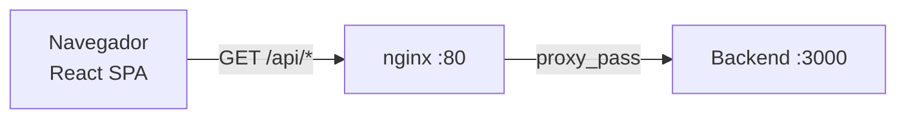

# UNIFIT — Frontend

Aplicación SPA (Single Page Application) de UNIFIT, construida con React y Vite, servida en producción mediante nginx con proxy inverso hacia el backend.

## Stack

- **React** 18
- **Vite** 6
- **TypeScript**
- **Tailwind CSS** 4 + **Material UI (MUI)** 7
- **React Router** 7
- **Axios** para peticiones HTTP

## Estructura del código (`src/`)

```
src/
├── app/                 # Punto de entrada: App.tsx y rutas protegidas
│   ├── App.tsx
│   └── ProtectedRoute.tsx
├── features/            # Pantallas agrupadas POR ROL
│   ├── admin/           #   Área del administrador
│   ├── trainer/         #   Área del entrenador
│   ├── student/         #   Área del usuario (estudiante/profesor/administrativo)
│   └── shared/          #   Componentes compartidos entre roles
├── services/            # Clientes por dominio (hablan con el backend)
│   ├── usuario.service.ts
│   ├── rutina.service.ts
│   ├── biometria.service.ts
│   └── ...
├── lib/                 # Configuración central
│   ├── api.ts           #   Cliente axios + interceptores
│   └── auth.ts          #   Manejo de sesión (token y usuario en localStorage)
├── modules/             # Módulos compartidos de gran tamaño
├── shared/              # Componentes reutilizables
├── data/                # Datos, tipos y constantes
└── assets/              # Imágenes e ilustraciones
```

## Comunicación con el backend

El frontend **no llama al backend directamente**. Las peticiones van a nginx, que actúa como reverse proxy:



### Cliente HTTP (`lib/api.ts`)

Un único cliente `axios` con `baseURL` apuntando a `/api`. Usa **interceptores**:

- **Request**: inyecta el token JWT en el header `Authorization: Bearer ...`.
- **Response**: si recibe un `401`, cierra la sesión y redirige al login automáticamente.

### Sesión (`lib/auth.ts`)

El token y los datos del usuario se guardan en `localStorage`. El `rol` determina qué área se muestra:

| Rol (backend) | Plataforma (front) | Carpeta |
|---|---|---|
| `admin` | `admin` | `features/admin/` |
| `entrenador` | `trainer` | `features/trainer/` |
| `usuario` | `student` | `features/student/` |

El mapeo se realiza en `mapRolToPlatform()` dentro de `lib/auth.ts`.

## Variables de entorno

Copiar `.env.example` a `.env`:

| Variable | Descripción |
|---|---|
| `VITE_API_URL` | URL base de la API (por defecto `http://localhost:3000/api`) |

## Desarrollo

```bash
npm install          # Instala dependencias
npm run dev          # Levanta el servidor de desarrollo (Vite)
```

## Producción

```bash
npm run build        # Genera el build estático en dist/
```

El build es servido por **nginx** (ver `Dockerfile` y `nginx.conf`):

- Archivos estáticos cacheados (`/assets/`).
- SPA fallback a `index.html` para el enrutado del lado del cliente.
- Proxy de `/api/*` hacia el backend.

## Build multi-stage (Docker)

```mermaid
flowchart LR
    node[Etapa 1<br/>node:20-alpine<br/>npm ci + build] --> nginx[Etapa 2<br/>nginx:alpine<br/>sirve dist/]