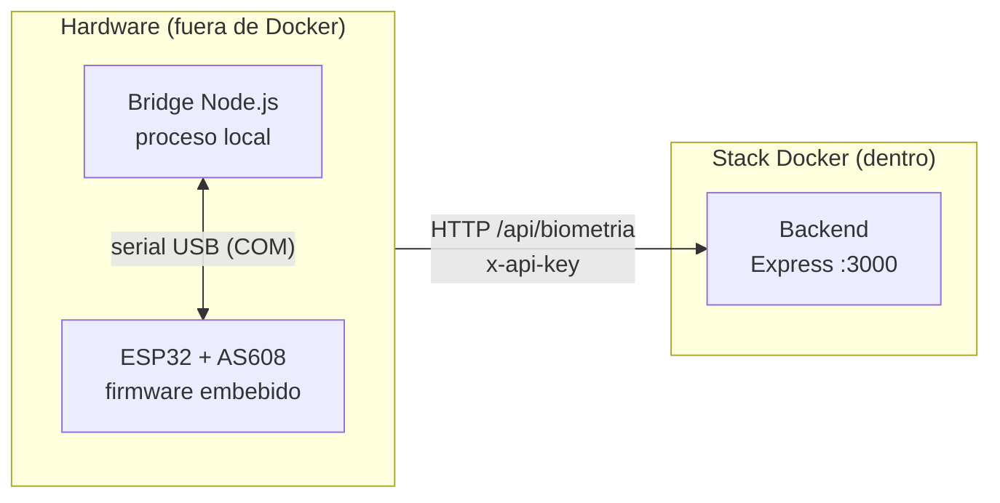
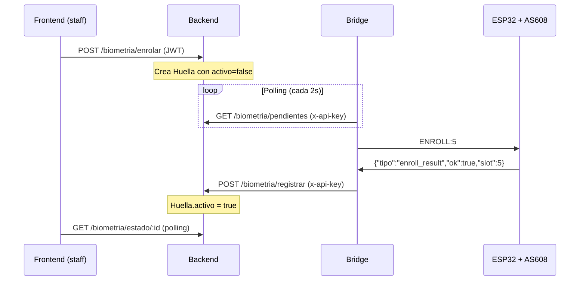

# UNIFIT — Hardware (biometría)

Componente de control de acceso y registro de asistencia por **huella digital**. Está compuesto por un microcontrolador **ESP32**, un sensor de huellas **AS608** y un **puente (bridge)** en Node.js que los conecta con el backend.

> **IMPORTANTE — Este componente corre FUERA del stack Docker.**
> No es un servicio del despliegue principal; es un cliente externo instalado
> físicamente en la recepción del gimnasio.

## ¿Por qué no se dockeriza?

Este componente trabaja con **hardware físico real**, por lo que no tiene sentido incluirlo en el stack Docker:

1. **Firmware embebido en el ESP32** — el código se compila y se *flashea* (graba) directamente en el chip de cada dispositivo, no se ejecuta como proceso de servidor.
2. **Acceso directo al puerto serial/USB** — el bridge necesita leer y escribir sobre el puerto físico (`COM3`/ dispositivo USB) al que está conectado el ESP32, algo que un contenedor no puede acceder de forma portable.
3. **Es un cliente, no un servidor** — se comunica *hacia* el backend por red (polling), a diferencia de los servicios del stack, que *reciben* peticiones.

## Arquitectura



La comunicación es **inversa**: el dispositivo (a través del bridge) *llama* a la API del backend, no al revés. El bridge consulta periódicamente (polling) si hay huellas pendientes de enrolar o verificar.

## Flujo biométrico



## Componentes

### ESP32 + AS608 (firmware)

El firmware se escribe en el ESP32 con PlatformIO/Arduino IDE. Véase `config.h` para los parámetros de conexión.

| Configuración | Valor |
|---|---|
| Baud rate serial (ESP32 ↔ PC) | `115200` |
| Baud rate sensor (ESP32 ↔ AS608) | `57600` |

### Cableado (pines)

| Señal | Pin ESP32 | Pin AS608 |
|---|---|---|
| RX (datos) | GPIO 16 | TX |
| TX (datos) | GPIO 17 | RX |
| VCC | 5V | VCC |
| GND | GND | GND |

### Bridge (puente)

Proceso Node.js que corre en la máquina de recepción conectada al ESP32. Se ubica en [`esp32-as608/bridge/`](esp32-as608/bridge/).

Variables de entorno necesarias:

```env
PUERTO_SERIAL=COM3
BAUD_RATE=115200
BACKEND_URL=http://localhost:3000/api
BIOMETRIA_API_KEY=una_clave_secreta_larga
INTERVALO_POLL_MS=2000
```

Para ejecutarlo:

```bash
cd esp32-as608/bridge
npm install
npm start
```

## Protocolo serial (Bridge ↔ ESP32)

Comandos del bridge hacia el ESP32:

```
ENROLL:5\n   -- Capturar y guardar huella en el slot 5
VERIFY\n     -- Capturar y comparar contra todas las huellas
```

Respuestas del ESP32 (JSON):

```json
{"tipo":"enroll_result","ok":true,"slot":5}
{"tipo":"enroll_result","ok":false,"error":"Sin dedo detectado"}
{"tipo":"verify_result","ok":true,"slot":2}
{"tipo":"verify_result","ok":false,"error":"Huella no encontrada"}
```

## Seguridad

- El bridge se autentica con **API Key** (header `x-api-key`), distinto al JWT de los usuarios.
- **El template biométrico vive en el sensor AS608**, no en la base de datos.
  En la base de datos solo se guarda metadata (índice/`slot` del sensor).
- Rate limiting por endpoint para mitigar abuso.

Ver [`docs/protocolo-biometrico.md`](../docs/protocolo-biometrico.md) para el detalle completo del protocolo.