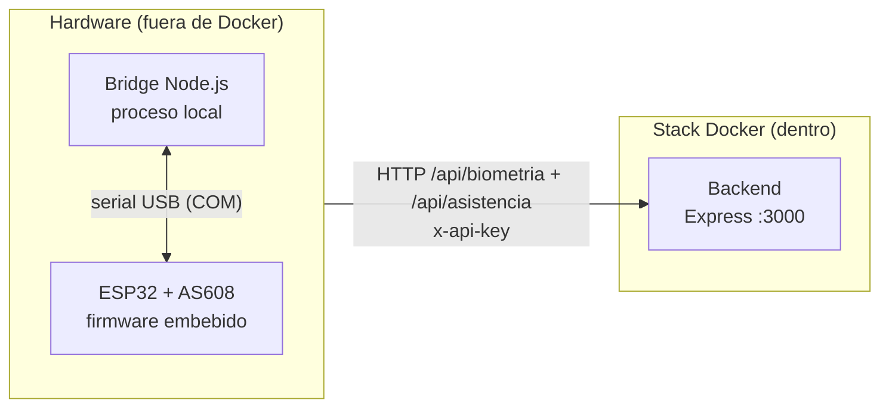
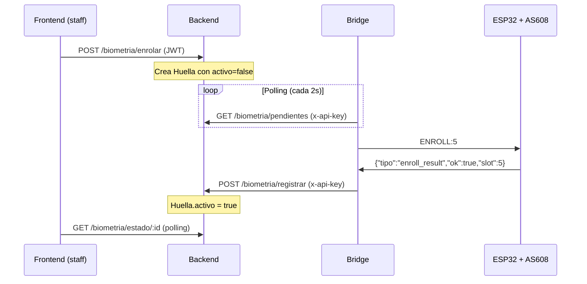
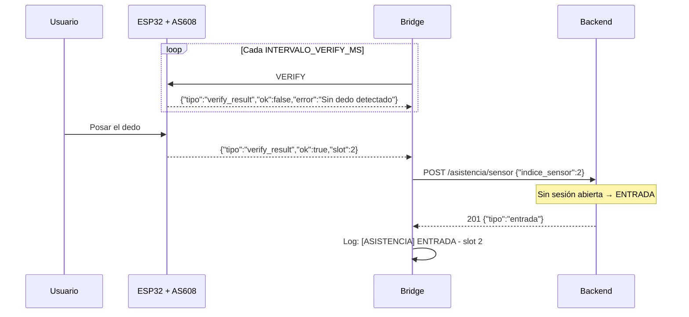

# UNIFIT — Hardware (biometría)

Componente de control de acceso y registro de asistencia por **huella digital**. Está compuesto por un microcontrolador **ESP32**, un sensor de huellas **AS608** y un **puente (bridge)** en Node.js que los conecta con el backend.

> **IMPORTANTE — Este componente corre FUERA del stack Docker.**
> No es un servicio del despliegue principal; es un cliente externo instalado
> físicamente en la recepción del gimnasio.

## ¿Por qué no se dockeriza?

Este componente trabaja con **hardware físico real**, por lo que no tiene sentido incluirlo en el stack Docker:

1. **Firmware embebido en el ESP32** — el código se compila y se *flashea* (graba) directamente en el chip de cada dispositivo, no se ejecuta como proceso de servidor.
2. **Acceso directo al puerto serial/USB** — el bridge necesita leer y escribir sobre el puerto físico (`COM3`/ dispositivo USB) al que está conectado el ESP32, algo que un contenedor no puede acceder de forma portable.
3. **Es un cliente, no un servidor** — se comunica *hacia* el backend por red (polling), a diferencia de los servicios del stack, que *reciben* peticiones.

## Arquitectura


```mermaid
flowchart LR
    subgraph docker["Stack Docker (dentro)"]
        be[Backend<br/>Express :3000]
    end

    subgraph ext["Hardware (fuera de Docker)"]
        esp32[ESP32 + AS608<br/>firmware embebido]
        bridge[Bridge Node.js<br/>proceso local]
        bridge <-->|"serial USB (COM)"| esp32
    end

    ext -->|"HTTP /api/biometria + /api/asistencia<br/>x-api-key"| be
```

La comunicación es **inversa**: el dispositivo (a través del bridge) *llama* a la API del backend, no al revés. El bridge **consulta periódicamente (polling)** si hay huellas pendientes de enrolar y, además, **verifica de forma continua** las huellas que posa el usuario para registrar entradas y salidas.

## Flujo biométrico


```mermaid
sequenceDiagram
    participant FE as Frontend (staff)
    participant BE as Backend
    participant BR as Bridge
    participant HW as ESP32 + AS608

    FE->>BE: POST /biometria/enrolar (JWT)
    Note over BE: Crea Huella con activo=false
    loop Polling (cada 2s)
        BR->>BE: GET /biometria/pendientes (x-api-key)
    end
    BR->>HW: ENROLL:5
    HW->>BR: {"tipo":"enroll_result","ok":true,"slot":5}
    BR->>BE: POST /biometria/registrar (x-api-key)
    Note over BE: Huella.activo = true
    FE->>BE: GET /biometria/estado/:id (polling)
```

## Flujo de asistencia (entrada / salida)

El bridge mantiene un ciclo propio de verificación **independiente** del polling de
enrolamientos. Cada `INTERVALO_VERIFY_MS` envía `VERIFY` al ESP32 si no hay nada más
pendiente; el sensor responde con el `slot` de la huella reconocida y el bridge lo
envía al backend.


```mermaid
sequenceDiagram
    participant U as Usuario
    participant HW as ESP32 + AS608
    participant BR as Bridge
    participant BE as Backend

    loop Cada INTERVALO_VERIFY_MS
        BR->>HW: VERIFY
        HW-->>BR: {"tipo":"verify_result","ok":false,"error":"Sin dedo detectado"}
    end
    U->>HW: Posar el dedo
    HW-->>BR: {"tipo":"verify_result","ok":true,"slot":2}
    BR->>BE: POST /asistencia/sensor {"indice_sensor":2}
    Note over BE: Sin sesión abierta → ENTRADA
    BE-->>BR: 201 {"tipo":"entrada"}
    BR->>BR: Log: [ASISTENCIA] ENTRADA - slot 2
```

Quien decide si es **entrada** o **salida** es el backend (única fuente de verdad):
si el usuario no tiene una asistencia abierta, registra entrada; si ya la tiene, la
cierra y devuelve la duración. El bridge solo reenvía el `slot`.

Reglas del ciclo:

| Regla | Valor por defecto | Motivo |
|---|---|---|
| `INTERVALO_VERIFY_MS` | `1000` | Cada cuánto se consulta el sensor |
| `COOLDOWN_VERIFY_MS` | `5000` | Evita registrar dos veces si el dedo sigue apoyado |
| `TIMEOUT_VERIFY_MS` | `13000` | Libera el ciclo si el sensor no responde (el firmware captura hasta 10s) |

Prioridades: si hay un **enrolamiento en curso**, el ciclo de verificación se detiene
(el sensor está ocupado); y si el puerto serial se cierra, los estados internos se
reinician al reconectar.

La confirmación es la **línea de log del bridge** y, en la app, el historial de
asistencias del usuario.

## Componentes

### ESP32 + AS608 (firmware)

El firmware se escribe en el ESP32 con PlatformIO/Arduino IDE. Véase `config.h` para los parámetros de conexión.

| Configuración | Valor |
|---|---|
| Baud rate serial (ESP32 ↔ PC) | `115200` |
| Baud rate sensor (ESP32 ↔ AS608) | `57600` |

### Cableado (pines)

| Señal | Pin ESP32 | Pin AS608 |
|---|---|---|
| RX (datos) | GPIO 16 | TX |
| TX (datos) | GPIO 17 | RX |
| VCC | 5V | VCC |
| GND | GND | GND |

### Bridge (puente)

Proceso Node.js que corre en la máquina de recepción conectada al ESP32. Se ubica en [`esp32-as608/bridge/`](esp32-as608/bridge/).

Variables de entorno necesarias:

```env
PUERTO_SERIAL=COM3
BAUD_RATE=115200
BACKEND_URL=http://localhost:3000/api
BIOMETRIA_API_KEY=una_clave_secreta_larga
INTERVALO_POLL_MS=2000
INTERVALO_VERIFY_MS=1000
COOLDOWN_VERIFY_MS=5000
TIMEOUT_VERIFY_MS=13000
```

`PUERTO_SERIAL` es opcional: si se omite, el bridge detecta solo el ESP32 (CH340 /
CP210x / Espressif) y lo confirma leyendo su mensaje `ready`.

`BIOMETRIA_API_KEY` debe ser **la misma** que tiene el backend en su entorno (ver
`BIOMETRIA_API_KEY` en `docker-compose.yml`); es la credencial con la que el bridge
llama a `/api/biometria/*` y `/api/asistencia/sensor`.

Para ejecutarlo:

```bash
cd esp32-as608/bridge
npm install
npm start
```

## Protocolo serial (Bridge ↔ ESP32)

Comandos del bridge hacia el ESP32:

```
ENROLL:5\n   -- Capturar y guardar huella en el slot 5
VERIFY\n     -- Capturar y comparar contra todas las huellas
```

Respuestas del ESP32 (JSON):

```json
{"tipo":"enroll_result","ok":true,"slot":5}
{"tipo":"enroll_result","ok":false,"error":"Sin dedo detectado"}
{"tipo":"verify_result","ok":true,"slot":2}
{"tipo":"verify_result","ok":false,"error":"Huella no encontrada"}
```

## Seguridad

- El bridge se autentica con **API Key** (header `x-api-key`), distinto al JWT de los usuarios.
- **El template biométrico vive en el sensor AS608**, no en la base de datos.
  En la base de datos solo se guarda metadata (índice/`slot` del sensor).
- El backend es el único que decide entrada vs. salida y aplica las reglas (usuario
  activo, una sola sesión abierta, duración máxima de 6 h).
- Rate limiting por endpoint para mitigar abuso.

## Mejoras futuras

- **Aviso audible en el PC de recepción** al registrar entrada/salida (el bridge puede
  reproducir un `.wav` por evento sin tocar el firmware).
- **Indicador luminoso** en el puente o en el propio sensor.
- **Auto-verificación en firmware** para eliminar el ciclo de sondeo del bridge.

Ver [`docs/protocolo-biometrico.md`](../docs/protocolo-biometrico.md) para el detalle completo del protocolo.